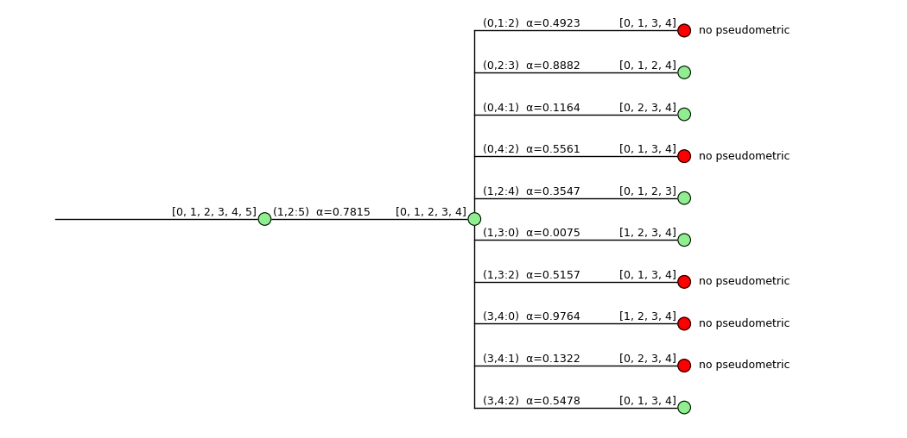
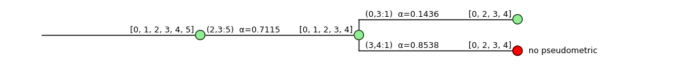

# Practical course graph theory

**Authors**: Max Beining, Hannes Junker, Johannes Klier

## **Dependencies**

The pipeline presented here uses a modified version of the [Erdbeermet](https://github.com/david-schaller/Erdbeermet) package, for analyzing R matrices. The pipeline requires Python 3.7 or higher and also:

* [Numpy](https://numpy.org)
* [Scipy](http://www.scipy.org/install.html)
* [Matplotlib](https://matplotlib.org/)
* [Pandas](https://pandas.pydata.org/)
* [NetworkX](https://networkx.org/)


## **Usage / Examples**

The following sections are structured according to the application of the individual work packages (See **Praktikumsbeschreibung_v1.5**). In each case, a small example of the call is included, whereby everything is based on the class `Pipeline` from the file `pipe.py`. The `Pipeline`-class contains the following methods, which are accessible for the user:

* [wp2](#workpackage-2)
* [wp3](#workpackage-3)
* [wp4](#workpackage-4)
* [analyse](#anlyse-a-single-szenario)

Within the class `Pipeline` the combinations of *global* parameters are set. `Pipeline` has only three attributes (compare [erdbeermet.simulation](https://github.com/david-schaller/Erdbeermet)) according to which the simulations are carried out for a work package:

* `circular` (Default: `False`)
* `clocklike` (Default: `False`)
* `first_candidate_only` (Default: `True`)

Examples of creating classes of different attributes:
```python
from pipe import Pipeline

p1 = Pipeline() # cicular=False, clocklike=False
p2 = Pipeline(circular=True) # only circular=True
p3 = Pipeline(circular=True, clocklike=True) # both True
```

Based on this, the respective work packages can be simulated (see following sections). A folder with the results for every workpackage is always created and a simple *.log*-File to keep track of the simulations. Example:
```
2022-01-22 20:46:24,329 - simulation_wp2.log - INFO - Start wp2_result_circular-True_clocklike-True
2022-01-22 21:07:02,754 - simulation_wp2.log - INFO - Step:  6000 / 60000 - write DataFrame
2022-01-22 21:26:35,528 - simulation_wp2.log - INFO - Step: 12000 / 60000 - write DataFrame
...
```

#### **Note**
We are aware that the respective workpackages 2 to 4 could also have been combined into one large function, with parameters for all types of simulations. In view of the task, however, we decided against this in order to be able to perform individual simulations in a targeted manner.


---
### **Workpackage 2**
To perform a simulation for work package 2, individual parameters can be adjusted.

<details>
<summary><b>Parameters of WP2</b> Function (click to expand)</summary>

| Parameter (with default values) | Type  | Description |
| --- | --- | --- |
| `N` | `int` | Number of generated random simulation szenarios with 'erdbeermet.simulation'. The algorithmen will be executed for N simulations and all number of leafes between `min_leafes` and `max_leafes`. |
| `min_leafes = 6` | `int` | Minimal number of leaves for `N` simulations. |
| `max_leafes = 8` | `int` | Maximum number of leaves for `N` simulations. |
| `first_leaves = [0,1,2,3]` | `list` |  List of the first 4 leafes in the simulation. The default is [0,1,2,3] because the simulated scenarios from '*erdbeermet.simulation*' will always start with leaves identifier from 0 to 3. List will use to identify, if the first four leaves are correct recognized. |
| `choose_random = True` | `bool` | The `pipeline` algorithm will choose out of the list of candidates for the last step only one random candidate (with 4 leafes) as an positive R-Metric. All other will be set to *random loser*.|
| `seed_szenario = 0` | `int` |  Seed to make all szenarios for the same number of `N` simulations reproducible. By default it is set to 0 (if `None`, use a random seed between 0 and max int32). |
| `seed_pipeline = 0` | `int`| Seed to make all randomly choosen positive candidate for the same number of N simulations (with same `seed_szenario`) reproducible. Only useful with `choose_random=True`. By default it is set to 0 (if `None`, use a random seed between 0 and max int32). |
| `add_name = ""` | `string` | Additional name for the simulation process (if you want to run multiple simulations - this name will add)|

</details>


#### **Example**

To generate 1000 different R-matrices with the setting `circular=True` between a minimum of 6 and a maximum of 9 items by **erdbeermet.simulation** and then analyze them by **erdbeermet.recognize**, randomly selecting a positive one from the final candiates and declaring it as the winner, the following call can be used.

```python
p = Pipeline(circular=True)
p.wp2(N=1000, max_leafes=9, choose_random=True)
# or: Pipeline(circular=True).wp2(N=1000, max_leafes=9, choose_random=True)
```

#### **Results**
Two things are created: a folder **wp2_result** (if not already existing) with the respective results summarized in a **.csv** file. The **.csv** file consists of a *header* with the respective settings of the pipeline and the seeds. The following results are recorded per simulation:

<details>
<summary><b>Result</b> columns for <b>work package 2</b> (Click to expand)</summary>

| Column name | Type  | Description |
| --- | --- | --- |
| `nr` | `int` | Index **i** of simulation |
| `leaves` | `int` | Number of leaves **k**|
| `circular` | `bool` | Attribute of `Pipeline` |
| `clocklike` | `bool` | Atttribute of `Pipeline` |
| `dead_end` | `bool` | Only `True` if the simulation analysed with **erdbeermet.recognize** has run into a dead end. The corresponding history of this simulation is also stored in the folder (see below).|
| `all_r_maps` | `int` |  Absolute number of identified candidates (positive R-Maps, all tests like *is_pseudometric* passed)|
| `find_first_4leaves` | `bool`| Only `True` if the specified first four leafes (ex. [0,1,2,3]) were also amongPraktikumsbeschreibung_v1.5he reconstruction. |
| `runtime` | `float` | Runtime for the simulation and recognition step.|

</details>

For are picture see [Example 2 (single Szenario)](#example-2-random-candidate-like-wp2).

If the algorithm of **erdbeermet.recognize** runs into a dead-end for a simulation, the corresponding simulation history is stored in the results folder. The name of the history contains the associated settings (circular,) of the pipeline, the used seeds of the random simulation (1st number) and the selection of the random candidate (2nd number), the number of items **k** and the index **i** of the simulation. Example name: `dead_end_wp2-result_circular-True_clocklike-False_seeds-0-0_k-6_i-801`.


---
### **Workpackage 3**
To perform a simulation for work package 3, individual parameters can be adjusted.

<details>
<summary><b>Parameters of WP3</b> Function (click to expand)</summary>

| Parameter (with default values) | Type  | Description |
| --- | --- | --- |
| `N` | `int` | Number of generated random simulation szenarios with 'erdbeermet.simulation'. The algorithmen will be executed for N simulations and all number of leafes between `min_leafes` and `max_leafes`. |
| `min_leafes = 6` | `int` | Minimal number of leaves for `N` simulations. |
| `max_leafes = 8` | `int` | Maximum number of leaves for `N` simulations. |
| `first_leaves = [0,1,2,3]` | `list` |  List of the first 4 leafes in the simulation. The default is [0,1,2,3] because the simulated scenarios from '*erdbeermet.simulation*' will always start with leaves identifier from 0 to 3. List will use to identify, if the first four leaves are correct recognized. |
| `B = [0,1,2,3]` | `list` | Leaf-identifier for the recognition algorithm. During the *recognition* no leaf from this list will be chosen to reduce as z. Only useful if `leaves_unknown` is set to `False`.|
| `leaves_unknown = False` | `bool` |  If set to `True` the algorithm will iterate over all permutations (in random order) in range of *k-leaves* (k is equal to the current number of items, between `min_leafes` and `max_leafes`) as leaf identifier `B` of size `subset` (maybe 3 or 4) until an R-Map is correctly identified (reconition tree has *no dead end*). In this case the resulting *.csv* file will have the following **additional columns**: **permu_count** (number of iteratios needed), **max_permu** (maximum number of possible permutations) and **permutation** (permutation as leaf_identifier B which produces the first R-Maps). |
| `subset = 4`| `int` | Number of core leaves from which random permutations are created and used as *leaf-identifier*. Only useful if `leaves_unknown=True`.|
| `choose_random = True` | `bool` | The `pipeline` algorithm will choose out of the list of candidates for the last step only one random candidate (with 4 leafes) as an positive R-Metric. All other will be set to *random loser*.|
| `seed_szenario = 0` | `int` |  Seed to make all szenarios for the same number of `N` simulations reproducible. By default it is set to 0 (if `None`, use a random seed between 0 and max int32). |
| `seed_pipeline = 0` | `int`| Seed to make all randomly choosen positive candidate for the same number of N simulations (with same `seed_szenario`) reproducible. Only useful with `choose_random=True`. By default it is set to 0 (if `None`, use a random seed between 0 and max int32). |
| `seed_permutations = 0` | `int` | Seed to make all randomly choosen positive candidate for the same number of `N` simulations (with same `seed_szenario`) reproducible. Only useful with `choose_random=True`. By default it is set to 0 (if None, use a random seed between 0 and max int32).
| `add_name = ""` | `string` | Additional name for the simulation process (if you want to run multiple simulations - this name will add)|

</details>


#### **Example**

To generate 1000 different R matrices with the setting `clocklike=True` between a minimum of 7 and a maximum of 9 elements by **erdbeermet.simulation** and then analyze them by **erdbeermet.recognize**. The core leaves (ex. [0,1,2,3]) can be either known (`leaves_unknown=False`) or unknown (`leaves_unknown=True`). In the first case the algorithm in **erdbeermet.recognize** is forbidden to reduce one of the first 4 leaves (default B=[0,1,2,3]) to z. In the second case, a subset of leaves of all permutations from 0 to max_leafes-1 is forbidden to reduce until an R-map was correctly identified. In the example below, the leaves are unknown.

```python
p = Pipeline(clocklike=True)
p.wp3(N=1000, min_leafes=7, max_leafes=9, leaves_unknown=True)
```

#### **Results**
As in workpackage 2 two things are generated: a folder **wp3_result** (if `leaves_unknown=True` the folder is called **wp3_permutations_result**) (if not already existing) with the respective results summarized in a **.csv** file. The **.csv** file consists also a *header* with the respective settings of the pipeline and the seeds. The following results are recorded per simulation for the setting `leaves_unknown=True`:

<details>
<summary><b>Result</b> columns for <b>work package 3</b> (Click to expand)</summary>

| Column name | Type  | Description |
| --- | --- | --- |
| `nr` | `int` | Index `i` of simulation |
| `leaves` | `int` | Number of leaves `k`|
| `circular` | `bool` | Attribute of `Pipeline` |
| `clocklike` | `bool` | Atttribute of `Pipeline` |
| `dead_end` | `bool` | Only `True` if the simulation analysed with `erdbeermet.recognize` has run into a dead end. The corresponding history of this simulation is also stored in the folder (see below).|
| `all_r_maps` | `int` |  Absolute number of identified candidates (positive R-Maps, all tests like *is_pseudometric* passed)|
| `find_first_4leaves` | `bool`| Only `True` if the specified first four leafes (ex. [0,1,2,3]) were also among the identified candidates. |
| `select_first_4leaves` | `bool` | Only `True` if the specified first four leafes (ex. [0,1,2,3]) have been randomly selected as winners. Only usefull if the parameter `chose_random` was set to `True`in the simulation process. |
| `r_steps` | `int` | Total number of R-steps that occur in both the simulation history and the reconstruction. |
| `r_steps_order` | `int` | Number of R-steps, which occurred in the same place in the simulation history and the reconstruction. |
| `permu_count` | `int`| Number of permutations used as leaf identifier until a correct R-map was correctly identified.|
| `max_permu` | `int`	|Total number of possible permutations |
| `permutation` | `list` | The permutation B as leaf identifier that correctly identifies an R-map for the first time. |
| `runtime` | `float` | Runtime for the simulation and recognition step.|

</details>

If `leaves_unknown=False`, then logically the columns *permut_count*, *max_permu* and *permutation* are omitted (see table above). For are picture see [Example 3 (single Szenario)](#example-3-permuations-like-wp3).


If the algorithm of **erdbeermet.recognize** runs into a dead-end for a simulation, the corresponding simulation history is stored in the results folder. The name of the history contains the associated settings (circular,) of the pipeline, the used seeds of the random simulation (1st number) and the selection of the random candidate (2nd number), the number of items **k** and the index **i** of the simulation. Example name: `dead_end_wp3-permutation-result_circular-True_clocklike-False_seeds-0-0_k-6_i-801`.


---
### **Workpackage 4**
To perform a simulation for work package 4, individual parameters can be adjusted.

<details>
<summary><b>Parameters of WP4</b> Function (click to expand)</summary>

| Parameter (with default values) | Type  | Description |
| --- | --- | --- |
| `N` | `int` | Number of generated random simulation szenarios with 'erdbeermet.simulation'. The algorithmen will be executed for N simulations and all number of leafes between `min_leafes` and `max_leafes`. |
| `min_leafes = 6` | `int` | Minimal number of leaves for `N` simulations. |
| `max_leafes = 8` | `int` | Maximum number of leaves for `N` simulations. |
| `first_leaves = [0,1,2,3]` | `list` |  List of the first 4 leafes in the simulation. The default is [0,1,2,3] because the simulated scenarios from '*erdbeermet.simulation*' will always start with leaves identifier from 0 to 3. List will use to identify, if the first four leaves are correct recognized. |
| `small_spike = True` | `bool` | If set to True, the recognition algorithmen will try to calculate the candidates for R-Steps with respect to the smallest spike length (for remaining items > 5). If multiple such candidates exist, the recognition will use an candidate at random. Additionally the algorithmen will add `_cycle-[True/False]` to dead ends (if they exists). |
| `choose_random = True` | `bool` | The `pipeline` algorithm will choose out of the list of candidates for the last step only one random candidate (with 4 leafes) as an positive R-Metric. All other will be set to *random loser*.|
| `seed_szenario = 0` | `int` |  Seed to make all szenarios for the same number of `N` simulations reproducible. By default it is set to 0 (if `None`, use a random seed between 0 and max int32). |
| `seed_pipeline = 0` | `int`| Seed to make all randomly choosen positive candidate for the same number of N simulations (with same `seed_szenario`) reproducible. Only useful with `choose_random=True`. By default it is set to 0 (if `None`, use a random seed between 0 and max int32). |
| `add_name = ""` | `string` | Additional name for the simulation process (if you want to run multiple simulations - this name will add)|

</details>

#### **Example**

To generate 2000 different R matrices with the setting `circular=True` and `clocklike=True` between a minimum of 6 and a maximum of 9 elements by **erdbeermet.simulation** and then analyze them by **erdbeermet.recognize**. 

```python
p = Pipeline(circular=True, clocklike=True)
p.wp4(N=2000, min_leafes=6, max_leafes=9, small_spike=True)
```

#### **Results**
As in workpackage 2 and 3 two things are generated: a folder **wp4_result** with the respective results summarized in a **.csv** file. The **.csv** file consists also a **header** with the respective settings of the pipeline and the seeds. The following results are recorded per simulation for the setting `small_spike=True` (By default, the setting is already set to `True`, it should only be clarified here only once more as an example):

<details>
<summary><b>Result</b> columns for <b>work package 4</b> (Click to expand)</summary>

| Column name | Type  | Description |
| --- | --- | --- |
| `nr` | `int` | Index `i` of simulation |
| `leaves` | `int` | Number of leaves `k`|
| `circular` | `bool` | Attribute of `Pipeline` |
| `clocklike` | `bool` | Atttribute of `Pipeline` |
| `dead_end` | `bool` | Only `True` if the simulation analysed with `erdbeermet.recognize` has run into a dead end. The corresponding history of this simulation is also stored in the folder (see below).|
| `all_r_maps` | `int` |  Absolute number of identified candidates (positive R-Maps, all tests like *is_pseudometric* passed)|
| `find_first_4leaves` | `bool`| Only `True` if the specified first four leafes (ex. [0,1,2,3]) were also among the identified candidates. |
| `select_first_4leaves` | `bool` | Only `True` if the specified first four leafes (ex. [0,1,2,3]) have been randomly selected as winners. Only usefull if the parameter `chose_random` was set to `True`in the simulation process. |
| `r_steps` | `int` | Total number of R-steps that occur in both the simulation history and the reconstruction. |
| `r_steps_order` | `int` | Number of R-steps, which occurred in the same place in the simulation history and the reconstruction. |
| `cycle_detected` | `bool` | Only `True` if the networkx algorithmen detected a cycle. In this case the underlying history will be stored in the resulting folder. |
| `runtime` | `float` | Runtime for the simulation and recognition step.|

</details>

If the algorithm of **erdbeermet.recognize** runs into a dead-end for a simulation, the corresponding simulation history is stored in the results folder as in the other workpackges (see above).In addition, whether a cycle was detected or not is appended to the name. Example name: `dead_end_wp4_result_circular-False_clocklike-False_v02_seeds-0-0_k-6_i-00801_cycle_False`.


---
## **Analyse a single Szenario**
This static function (it means you don't need a existing instance of the pipeline-class) is intended to be able to analyze individual scenarios. All possibilities of the previous work packages can be selected individually. This function is intended to be able to analyze individual scenarios. All possibilities of the previous work packages can be selected individually. A tree from `erdbeermet.tools.Tree` and, depending on the setting, a corresponding dictionary are returned.

<details>
<summary>Parameters to analyse a <b>single scenario</b> (click to expand)</summary>

| Parameter (with default values) | Type  | Description |
| --- | --- | --- |
|`scenario` | `class 'Scenario'` | A scenario given by the 'erdbeermet'-Packages. See also 'erdbeermet.simulate'.|
|`first_candidate_only = True` | `bool` | If `True`, only consider the first found candidate for a merge event inside the function *recognize* from the *erdbeermet*-Package. See also *erdbeermet.recognition*.|
| `B = []` | `list` | Leaf-identifier for the recognition algorithm. During the recognition no leaf from this list will be chosen to reduce as z. The default is `[]` (every leaf can be chosen). See also function *_find_candidates* from *erdbeermet.recognition*.|
| `first_leafes = [0,1,2,3]` | `list` | The first leaves of the history simulation.|
| `permu = False` | `bool` |  If set to `True` the algorithm will iterate over all permutations (in random order) in range of *k-leaves* (k is equal to the current number of items, between `min_leafes` and `max_leafes`) as leaf identifier `B` of size `subset` (maybe 3 or 4) until an R-Map is correctly identified (reconition tree has *no dead end*). In this case the resulting *.csv* file will have the following **additional columns**: **permu_count** (number of iteratios needed), **max_permu** (maximum number of possible permutations) and **permutation** (permutation as leaf_identifier B which produces the first R-Maps). Exacly like [workpackage 3](#workpackage-3).|
| `subset = 4`| `int` | Number of core leaves from which random permutations are created and used as *leaf-identifier*. Only useful if `permu=True`.|
| `choose_random = False` | `bool` | If set to `True`, in the pipeline algorithm out of the list of candidates for the last step, only one random candidate (with 4 leafes) is output as a positive R-Metric. All other will be set to *random loser*.|
| `small_spike = False` | `bool` | If `True` use recognition algorithm by smallest spike consumption for number of leaves > 5.|
| `seed_random = None` | `int` | Seed to make all randomly choosen positive candidate for the same number of N simulations (with same szenario) reproducible. Only useful with `choose_random=True`. By default it is set to None (use a random seed between 0 and max int32).|
| `seed_permu = False` | `int` | Seed to make all randomly choosen permutation reproducible. Only useful with `permu=True`. By default it is set to None (use a random seed between 0 and max int32). 
| `info = False` |`bool` | Print more information in the recognition algorithm. |
</details>

### **Example 1 (no options)**
```python
from pipe import Pipeline
from erdbeermet.simulation import simulate

s = simulate(6, branching_prob=0.0)
tree, d = Pipeline.analyse(s)
print(d)
tree.visualize()
```
```
d = {
    'complete_dead': False, 'all_r_maps': 5, 
    'find_first_4leaves': True, 'select_first_4leaves': True, 
    'common_r-steps_order': 1, 'common_r-steps': 2
}
```



### **Example 2 (random candidate, like wp2)**
```python
s = simulate(6, branching_prob=0.0)
tree, d = Pipeline.analyse(s, choose_random=True)
print(d)
tree.visualize()
```
```
d = {
    'complete_dead': False, 'all_r_maps': 5, 
    'find_first_4leaves': True, 'select_first_4leaves': False, 
    'common_r-steps_order': 2, 'common_r-steps': 2
}
```


### **Example 3 (permuations, like wp3)**
```python
s = simulate(6, branching_prob=0.0)
tree, d = Pipeline.analyse(s, permu=True)
print(d)
tree.visualize()
```
```
d = {
    'complete_dead': False, 'all_r_maps': 1, 
    'find_first_4leaves': False, 'select_first_4leaves': False, 
    'common_r-steps_order': 1, 'common_r-steps': 1, 
    'permu_count': 2, 'max_permu': 360, 'permutation': [0, 3, 2, 4]
}
```
